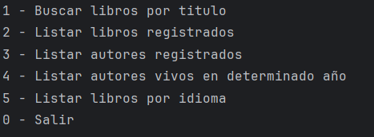
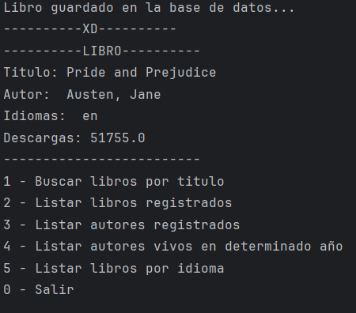
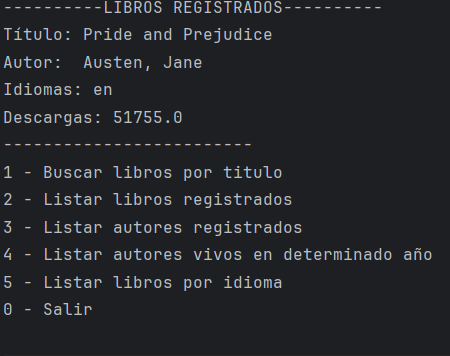
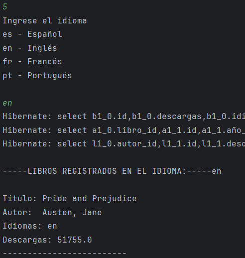

# Alura-Challenge-Conversor-de-Monedas-Java

¡Hola! Este Challenge es para completar el curso de Practicando Spring Boot: Challenge Literalura. 
Explicare un poco de su uso.

## Acerca del Challenge 🔎
Este Challenge se realizan solicitudes a la API de [Gutendex](https://gutendex.com/) para acceder a libros mediante su titulo o mediante el autor que escribio las obras, posteriormente cada consulta se guarda en una base de datos Postgres inicializada en el localhost.

## Pre-requisitos 🔧
Tener instalado Postgres en tu computadora y el administrador pgAdmin4. Se coloca la base de datos que vayas a utilizar en el archivo application.properties. Tanto el usuario y la contraseña para acceder a tu servidor deben ser ingresados tambien en sus respectivos campos.
## Galeria 📷

Menu de inicio

Busqueda de libro y libro guardado.

Listado de libros registrados.

Listado de libros por idioma de la obra

## Autor ✒
[Patricio Garcia](https://github.com/Patricio-GarciaRs) ✌🏼